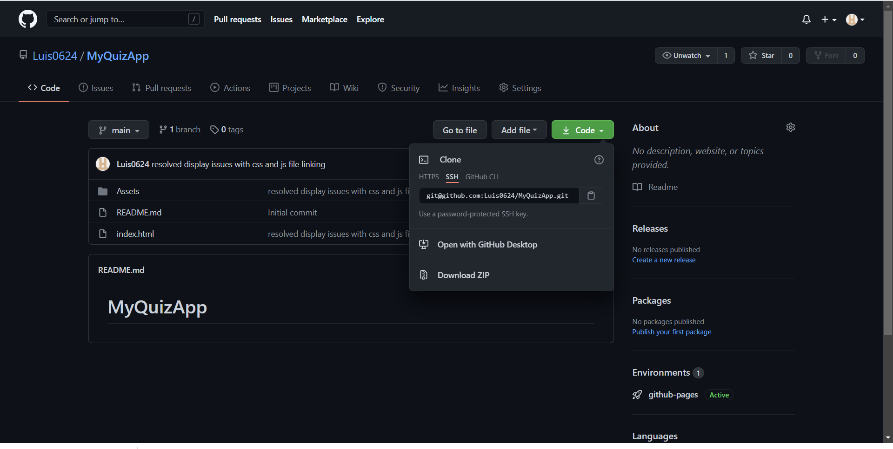

# MyQuizApp

First attempt at using Javascript to make a password generator
  
  ### Quiz App guidelines
  
  *  Once you're on the deployed site you will see the start button towards the bottom.

  * Click on the start button to begin the quiz and it will generate the first question, the answer choices and start your timer.

  * After making your choice you can click next to move on to the next question.

  * Once you've answered all the questions you get points if the answers were correct. 

  * You are then presented with a window prompt to enter a name for the highscore board and it is recorded and you can see it in the highscore box on the screen

  
### INSTALLATION

Use the following gitHub link [My Quiz App](https://github.com/Luis0624/MyQuizApp.git) to get to my github page and be able to clone the repo for my Quiz App.

Demo image for cloning github repo

[demo for cloning github repo](https://github.com/Luis0624/MyQuizApp.git)

[deployed Github pages link](https://luis0624.github.io/MyQuizApp/)

Sample image of deployed repo

After copying the ssh/https link open your terminal(MacOS) or Gitbash(Windows) and enter the command git clone "paste link here"
In your file finder open the folder that was created after cloning in the location you chose to clone the repo. Open the folder that was created with VS code(or any code editing program) and you should have the files and images that was used. 

### USAGE

Using VS code, or your choice of editor feel free to look through the HTML file,the CSS stylesheet and JS script. Contributions are welcome if they conform to the the following requirement(s):

* Suggestions can be made within comments above the code lines in question.

### CREDITS

### LICENSE
  
